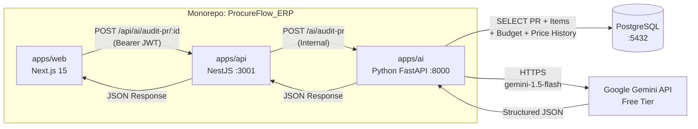

# PRD Final: ProcureFlow AI Engine — Phase 1
### Smart PR Risk Audit (Python FastAPI + Gemini Free Tier)

**Keputusan Final yang Dikonfirmasi:**
| Item | Keputusan |
| :--- | :--- |
| API Key | ✅ Gemini Free Tier (Google AI Studio) |
| Lokasi Service | ✅ Monorepo — `apps/ai/` |
| Fitur Phase 1 | ✅ Smart PR Risk Audit |
| Model | ✅ `gemini-1.5-flash` (Hemat Token & Kuota Besar: 15 RPM / 1.500 RPD) |

---

## Arsitektur Integrasi (Final)



---

## Folder Structure Final

```text
ProcureFlow_ERP/
├── apps/
│   ├── api/            ← NestJS (sudah ada) — tambah AiModule
│   ├── web/            ← Next.js (sudah ada) — tambah AiAuditModal
│   └── ai/             ← ✨ BARU: Python FastAPI AI Engine
│       ├── main.py
│       ├── config.py
│       ├── requirements.txt
│       ├── .env
│       ├── db/
│       │   ├── connection.py
│       │   └── queries.py
│       ├── routers/
│       │   └── audit_pr.py
│       ├── services/
│       │   └── audit_pr_service.py
│       ├── prompts/
│       │   └── audit_pr_prompt.txt
│       └── schemas/
│           └── audit_pr_schema.py
├── prisma/
├── docs/
└── package.json
```

---

## Data Contract: Request & Response

### Request (NestJS → Python)
```json
POST http://localhost:8000/ai/audit-pr
{
  "prId": "uuid-purchase-request"
}
```

### Response (Python → NestJS → Frontend)
```json
{
  "riskScore": 72,
  "riskLevel": "HIGH",
  "budgetImpact": {
    "remainingBefore": 15000000,
    "remainingAfter": 8500000,
    "usagePercentage": 43.3
  },
  "findings": [
    {
      "category": "PRICE_ANOMALY",
      "severity": "CRITICAL",
      "message": "Item 'Laptop Asus ROG' diajukan Rp 18.500.000/unit, 28% lebih mahal dari harga referensi master Rp 14.500.000.",
      "affectedItemSku": "LAPTOP-001"
    }
  ],
  "recommendation": {
    "action": "INVESTIGATE",
    "justification": "Terdapat anomali harga signifikan. Disarankan meminta klarifikasi harga dari requester."
  }
}
```
