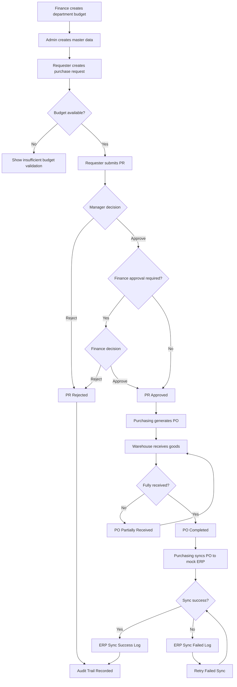

# Dokumentasi Business Flow ProcureFlow ERP

## Ringkasan Alur Utama

```text
Finance membuat budget department
        |
Admin menyiapkan master data
        |
Requester membuat purchase request
        |
System validasi budget
        |
Manager / Finance approve atau reject
        |
Purchasing generate purchase order
        |
Warehouse receiving barang
        |
Purchasing sync PO ke mock ERP
        |
System mencatat ERP log dan audit trail
```

## Mermaid Flowchart



## Penjelasan Per Step

| Step | Aktor | Penjelasan |
| --- | --- | --- |
| 1 | Finance | Membuat budget untuk department dengan allocated amount |
| 2 | Admin | Membuat department, item, supplier, warehouse, dan packaging unit |
| 3 | Requester | Membuat purchase request dengan satu atau banyak item |
| 4 | System | Menghitung total request dan membandingkan dengan remaining budget |
| 5 | Manager | Approve atau reject purchase request berdasarkan kebutuhan bisnis |
| 6 | Finance | Approve request yang terkait kontrol budget jika diperlukan |
| 7 | Purchasing | Generate purchase order dari PR yang sudah approved |
| 8 | Warehouse | Menerima barang sebagian atau seluruhnya |
| 9 | System | Update budget transaction, receiving status, dan PO status |
| 10 | Purchasing | Sync PO ke mock ERP |
| 11 | System | Membuat ERP sync log success atau failed |
| 12 | Purchasing | Retry sync jika sebelumnya failed |
| 13 | System | Mencatat semua aktivitas penting ke audit trail |

## Status Transition

### Purchase Request

```text
DRAFT -> SUBMITTED -> APPROVED
                  -> REJECTED
                  -> CANCELLED
```

| Status | Arti |
| --- | --- |
| DRAFT | PR masih bisa diedit |
| SUBMITTED | PR menunggu approval |
| APPROVED | PR disetujui dan siap dibuat PO |
| REJECTED | PR ditolak oleh approver |
| CANCELLED | PR dibatalkan |

### Purchase Order

```text
DRAFT -> ISSUED -> PARTIALLY_RECEIVED -> RECEIVED
      -> CANCELLED
```

| Status | Arti |
| --- | --- |
| DRAFT | PO baru dibuat |
| ISSUED | PO sudah dikirim atau siap diterima |
| PARTIALLY_RECEIVED | Sebagian barang sudah diterima |
| RECEIVED | Semua barang sudah diterima |
| CANCELLED | PO dibatalkan |

### Receiving

```text
PARTIAL -> FULL
        -> CANCELLED
```

| Status | Arti |
| --- | --- |
| PARTIAL | Receiving belum memenuhi seluruh quantity PO |
| FULL | Seluruh quantity sudah diterima |
| CANCELLED | Receiving dibatalkan |

### ERP Sync

```text
PENDING -> SUCCESS
        -> FAILED -> RETRYING -> SUCCESS
                            -> FAILED
```

| Status | Arti |
| --- | --- |
| PENDING | Sync sedang diproses |
| SUCCESS | Sync berhasil |
| FAILED | Sync gagal dan dapat dicoba ulang |
| RETRYING | Log lama sedang dalam proses retry |

## Catatan Bisnis

- PR tidak boleh disubmit jika budget tidak cukup.
- PO hanya boleh dibuat dari PR yang sudah approved.
- Receiving quantity tidak boleh melebihi ordered quantity.
- Failed ERP sync harus menyimpan error message.
- Setiap aktivitas penting wajib memiliki audit trail.
