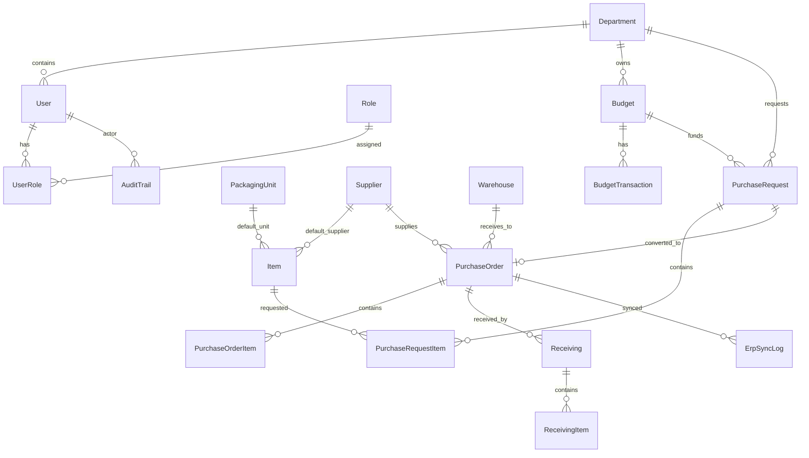

# Dokumentasi Database Design

## Overview

Database ProcureFlow ERP dirancang untuk mendukung procurement workflow end to end. Model utama mencakup user, role, master data, budget, purchase request, purchase order, receiving, ERP sync log, dan audit trail.

## ERD Explanation

## Entity Details

| Entity | Purpose | Important Fields | Main Relationships |
| --- | --- | --- | --- |
| User | Menyimpan pengguna sistem | email, username, passwordHash, fullName, status, departmentId | Many-to-many dengan Role, belongs to Department |
| Role | Menyimpan role akses | name, description, isSystem | Many-to-many dengan User |
| Department | Unit organisasi | code, name, description, managerId, parentId, isActive | Memiliki User, Budget, PurchaseRequest |
| Item | Catalog barang | sku, name, category, brand, estimatedUnitPrice | Relasi ke Supplier dan PackagingUnit |
| Supplier | Vendor barang | code, name, contactName, email, phone, paymentTerms | Digunakan pada PurchaseOrder |
| Warehouse | Lokasi penerimaan | code, name, address, description | Digunakan pada PurchaseOrder dan Receiving |
| PackagingUnit | Satuan barang | code, name, description | Digunakan pada Item, PR item, dan PO item |
| Budget | Alokasi dana department | code, name, fiscalYear, allocatedAmount, status | Belongs to Department, memiliki BudgetTransaction dan PR |
| BudgetTransaction | Histori perubahan budget | transactionNo, type, amount, status | Belongs to Budget |
| PurchaseRequest | Permintaan pembelian | requestNumber, title, status, priority, totalAmount | Belongs to requester, Department, Budget |
| PurchaseRequestItem | Item dalam PR | itemId, quantity, estimatedUnitPrice, lineTotal | Belongs to PurchaseRequest dan Item |
| Approval | Representasi proses approval | approver, status, decision, reason | Terkait PurchaseRequest melalui workflow/audit |
| PurchaseOrder | Dokumen pembelian | poNumber, status, totalAmount, supplierId, warehouseId | Dibuat dari PurchaseRequest |
| PurchaseOrderItem | Item dalam PO | itemId, quantityOrdered, quantityReceived, unitPrice | Belongs to PurchaseOrder |
| Receiving | Dokumen penerimaan | receivingNumber, status, receivedAt, deliveryNoteNo | Belongs to PurchaseOrder dan Warehouse |
| ReceivingItem | Detail barang diterima | quantityReceived, quantityAccepted, quantityRejected, scannedCode | Belongs to Receiving dan PO item |
| ErpSyncLog | Log sinkronisasi ERP | operation, status, attemptNo, errorMessage, externalId | Belongs to PurchaseOrder |
| AuditTrail | Histori aktivitas | action, entityType, entityId, actorId, before, after | Actor adalah User |

## Suggested Indexes

| Table | Suggested Index |
| --- | --- |
| User | email, username, status, departmentId |
| Role | name |
| Department | code, managerId, isActive |
| Item | sku, name, category, isActive |
| Supplier | code, name, isActive |
| Warehouse | code, isActive |
| PackagingUnit | code, isActive |
| Budget | code, departmentId, fiscalYear, status |
| BudgetTransaction | budgetId, type, status, occurredAt |
| PurchaseRequest | requestNumber, status, departmentId, budgetId, requesterId |
| PurchaseOrder | poNumber, status, supplierId, purchaseRequestId |
| Receiving | receivingNumber, purchaseOrderId, status |
| ErpSyncLog | purchaseOrderId, status, operation, createdAt |
| AuditTrail | actorId, entityType, action, createdAt |

## Important Enums

| Enum | Values |
| --- | --- |
| UserStatus | INVITED, ACTIVE, SUSPENDED, DISABLED |
| BudgetStatus | DRAFT, ACTIVE, CLOSED, CANCELLED |
| BudgetTransactionType | ALLOCATION, ADJUSTMENT, RESERVATION, RELEASE, COMMITMENT, CONSUMPTION, REVERSAL |
| PurchaseRequestStatus | DRAFT, SUBMITTED, APPROVED, REJECTED, CANCELLED |
| PurchaseRequestPriority | LOW, NORMAL, HIGH, URGENT |
| PurchaseOrderStatus | DRAFT, ISSUED, PARTIALLY_RECEIVED, RECEIVED, CANCELLED |
| ReceivingStatus | PARTIAL, FULL, CANCELLED |
| ErpSyncOperation | CREATE_PO, UPDATE_PO, CANCEL_PO |
| ErpSyncStatus | PENDING, SUCCESS, FAILED, RETRYING |
| AuditAction | CREATE, UPDATE, DELETE, LOGIN, SUBMIT, RECEIVE, SYNC_ERP, RETRY_ERP_SYNC |
| AuditEntityType | USER, ROLE, DEPARTMENT, ITEM, SUPPLIER, WAREHOUSE, PACKAGING_UNIT, BUDGET, PURCHASE_REQUEST, PURCHASE_ORDER, RECEIVING, ERP_SYNC_LOG, SYSTEM |

## Data Integrity Rules

- Email user harus unik.
- Code master data harus unik.
- PR total amount harus sama dengan total line item.
- PR tidak boleh submit jika budget tidak cukup.
- PO hanya boleh dibuat dari PR approved.
- Receiving quantity tidak boleh melebihi ordered quantity.
- Failed ERP sync harus menyimpan error message.
- Audit trail tidak boleh diubah oleh user biasa.
